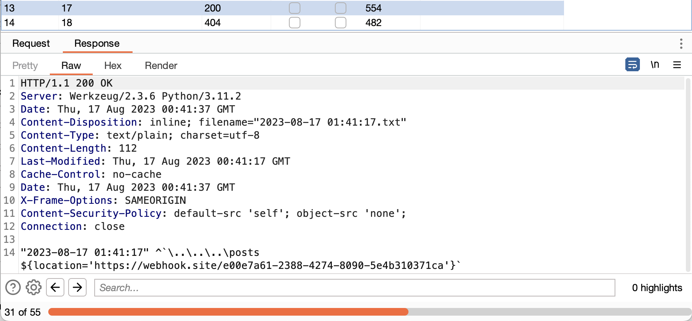

# DUCKY NOTES: ENDGAME

the final sequel of of the 4 parts challenge `DUCKY NOTES`:


- [ducky_notes_4.zip](assets/ducky_notes_4.zip)

this challenge has a CSP rule of:
```py
@app.after_request
def add_header(response):
    response.headers['X-Frame-Options'] = 'SAMEORIGIN'
    response.headers['Content-Security-Policy'] = "default-src 'self'; object-src 'none';"
    return response
```

and all the vues templates has escaped untrusted inputs. however there is a single endpoint that is not escaping our untrusted input, and that is:

```py
@app.errorhandler(Exception)
def handle_error(e):
    if not e.args or "username" not in e.args[0].keys():
        return e, 500

    error_date = datetime.datetime.now().strftime('%Y-%m-%d %H:%M:%S')
    post = e.args[0]
    log_message = f'"{error_date}" {post["username"]} {post["content"]}'

    with open(f"{app.config['LOG_DIR']}{error_date}.txt", 'w') as f:
        f.write(log_message)

    return log_message, 500
```

if we can get an exception to occur in one of the endpoints that raises an `Exception` with a post object as a parameter, we can get an XSS via `post["username"]` / `post[content]`.

looking at the app routes, we can see that `GET` `/posts/` does that:

```py
@web.route('/posts/', methods=['GET'])
@auth_required
def posts(username):
    if username != 'admin':
        return jsonify('You must be admin to see all posts!'), 401
    frontend_posts = []
    posts = db_get_all_users_posts()
    for post in posts:
        try:
            frontend_posts += [{'username': post['username'],
                                'title': post['title'],
                                'content': post['content']}]
        except:
            raise Exception(post)
    return render_template('posts.html', posts=frontend_posts)
```

we can get XSS if we can raise a `KeyError` exception in this line:

```py
    frontend_posts += [{'username': post['username'],
                        'title': post['title'],
                        'content': post['content']}]
```

raising a `KeyError` in this route means creating a post without one of these keys: `[username, title, content]`. let's see if we can do that:

```py
def query(con, query, args=(), one=False):
    c = con.cursor()
    c.execute(query, args)
    rv = [dict((c.description[idx][0], value)
        for idx, value in enumerate(row) if value != None) for row in c.fetchall()]
    return (rv[0] if rv else None) if one else rv

def db_get_all_users_posts():
    con = sqlite3.connect('database/data.db')

    posts = query(con, 'SELECT users.username as username, title, content, hidden from posts INNER JOIN users ON users.id = posts.user_id ')
    return posts
```

`query()` does not return a row if its value is `None`, so if we can get one of the post columns to be `None` we can raise a `KeyError` exception. this is the post creation route:

```py
@api.route('/posts', methods=['POST'])
@auth_required
def api_create_post(username):
    if not request.is_json:
        return jsonify('JSON is needed'), 400
    data = request.get_json()
    title = data.get('title', None)
    content = data.get('content', '')
    hidden = data.get('hidden', None)
    if not content or hidden == None:
        return jsonify('Content and hidden value required!'), 401
    if title and type(title) != str:
         return jsonify('Title value wrong format!'), 402
    if type(content) != str or type(hidden) != bool:
        return jsonify('Content and hidden value wrong format!'), 402
    db_create_post(username, {"title": title, "content": content, "hidden": hidden})
    return jsonify('Post created successfully!'), 200
```

`username` cannot be `None`, `content` also, but `title` does, if `title` is not in the request body, its default value is `None`, which then gets skipped when calling `query()`.

now we need to get the admin bot to visit `/posts/`, this is the reporting route:
```py
def bot(username):
    [snipped]
    client = webdriver.Chrome(options=options)

    client.get(f"http://localhost:1337/login")
    time.sleep(3)

    client.find_element(By.ID, "username").send_keys('admin')
    client.find_element(By.ID, "password").send_keys("admin")
    client.execute_script("document.getElementById('login-btn').click()")
    time.sleep(3)

    client.get(f"http://localhost:1337/posts/view/{username}")
    time.sleep(3000)

    client.quit()

@api.route('/report', methods=['POST'])
@auth_required
def api_report(username):
    thread = threading.Thread(target=bot, args=(username,))
    thread.start()

    return jsonify('Post reported successfully!'), 200
```

we need a path traversal in our username to get the bot to visit `/posts`, this is the username regex:

```py
USERNAME_REGEX = re.compile('^[A-za-z0-9\.]{2,}$')
```

`A-z` includes `Z-a`:


we already have `.` in the username regex, and `\` in this range. so we can do a path traversal back to `/posts`.

first create a post without a `title` field, and an XSS payload as `content`.


now as `admin`, we go to `/posts`:


we have XSS, but we need to bypass CSP. going back to the exception handling:

```py
    app.config['LOG_DIR'] = './static/logs/'

    error_date = datetime.datetime.now().strftime('%Y-%m-%d %H:%M:%S')
    post = e.args[0]
    log_message = f'"{error_date}" {post["username"]} {post["content"]}'

    with open(f"{app.config['LOG_DIR']}{error_date}.txt", 'w') as f:
        f.write(log_message)
```

`log_message` is written to a file at `static/logs/`, if we can find the filename and make the file's content valid JS, we can include the logfile, and we can acheive XSS as `default-src` is `self`.

we have these two chars allowed in the regex `^` and `` ` ``, we can turn the content of the logfile into:

```js
"DATE" ^ `USERNAME_END POST_CONTENT_BEGIN`
```

to do that, we need to register a user with a username ``^`\..\..\..\posts``:


then create a post with this content ``XSS_PAYLOAD` ``:


report for the first time so we can generate the exception, and note the `Date` header:


add one hour, lauch a burp intruder attack to find the exception log file.



delete all posts, so the previous invalid post don't raise exceptions anymore:


create a new post with a script tag:


then report again.


the flag is in a hidden admin post and cookies are HTTP only, just `fetch('/posts/admin')`.

NOTE: this write up is written after the CTF is ended and the infra is down.
